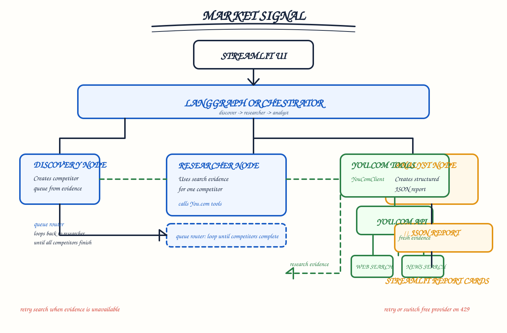
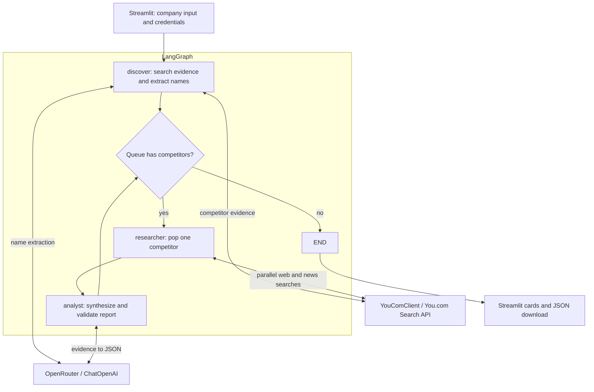

# Market Signal: architecture and code review

Reviewed against the implementation on 2026-09-06.

Market Signal is a Streamlit application that discovers up to three competitors,
collects live search evidence, and produces validated research cards and a
downloadable JSON snapshot. LangGraph controls a bounded, sequential competitor
queue; web and news requests for each competitor run concurrently.

## Implemented architecture

### Differences from the original concept diagram

| Original concept | Implemented design |
| --- | --- |
| Groq LLM in researcher | OpenRouter in discovery and analyst; researcher makes direct search calls |
| ReAct agent calling tools | Fixed LangGraph workflow; no autonomous tool-selection loop |
| `youcom_tools.py` wrapper | `youcom_client.py` is called directly |
| Web, news, academic search | Web and news sections of You.com's unified Search API; academic search is not implemented |
| Analyst after research | Analyst runs for each competitor, then routing checks the remaining queue |
| JSON report output | Pydantic report objects displayed as cards and serialized for download |

These are deliberate descriptions of the current code. Adding Groq, academic
search, or an agentic tool loop would be a separate feature change.

## Components and contracts

| File | Responsibility |
| --- | --- |
| `app.py` | Load local configuration, validate input/keys, run workflow, store snapshot identity, escape card HTML, render and export reports |
| `pipeline.py` | Compile discover → researcher → analyst graph, normalize the queue, stop at zero competitors |
| `youcom_client.py` | POST Search API requests, select web/news sections, retain snippets and dates, filter URLs, execute two searches concurrently |
| `analyst.py` | Extract names, request report JSON, normalize with Pydantic, restrict source URLs to supplied evidence |
| `models.py` | SearchResult, CompetitorReport, and ResearchState contracts |
| `test_pipeline.py` | Offline graph, parser, analyst, HTTP contract, and Streamlit regression tests |
| `scripts/check_secrets.py` | Pattern-based credential scan of tracked and unignored files |
| `.github/workflows/` | Credential scan and Python regression checks |

### Runtime sequence

1. Streamlit clears the previous snapshot on a new run, validates a nonblank
   company and API keys, and constructs the search client and analyst.
2. Discovery queries You.com for competitor evidence. If evidence is empty,
   it returns no competitors without calling the model.
3. OpenRouter extracts up to three company names. Names are trimmed,
   deduplicated case-insensitively, and filtered to exclude the target.
   The pipeline also enforces these queue invariants.
4. Research pops one name and runs two requests in a two-worker thread pool:
   product/pricing research selects `results.web`; recent-news research selects
   `results.news` with `freshness=month`. Each category retains up to eight
   unique HTTP(S) results and up to 6,000 snippet characters per result.
5. Analysis sends category-labelled evidence, URLs, and available dates to
   OpenRouter. Empty evidence produces an “Evidence unavailable” report
   without model invocation. Model JSON is normalized and validated.
6. Report identity is set from the queue. Website and source URLs not found
   exactly in the evidence are removed; source duplicates are removed.
7. The graph appends the report and loops while the queue is nonempty.
   Terminal status reports completion or zero discovered competitors.
8. Streamlit stores the company alongside the reports so editing the input
   cannot relabel an existing snapshot. A new run clears the old snapshot.
   JSON download includes `company` and an array of serialized `reports`.

There are at most seven search calls and four model invocations for three
competitors before provider retries. Empty evidence can reduce model calls.
Competitors run sequentially; only the two searches within a competitor run
concurrently. A legacy title-based `search_competitors` fallback remains for
clients without evidence discovery; the application uses the evidence/LLM path.

### State and output

`ResearchState` contains `company`, `competitor_queue`,
`current_competitor`, `search_results`, `reports`, and `status`.
Search results hold only the current competitor's evidence and are overwritten
on the next pass. Reports accumulate within the run.

`CompetitorReport` contains name, website, summary, positioning, pricing,
features, recent_news, strengths, watchouts, and sources. List/text normalization
accepts common model shape variations. Pydantic checks structure, not factual
truth. Evidence URL filtering prevents invented citations from being displayed
but does not prove that each claim is supported by its cited source.

## Configuration and external boundaries

Use Python 3.12 for the tested environment. See [README](README.md) for setup.

| Variable | Behavior |
| --- | --- |
| `OPENROUTER_API_KEY` | Required model credential |
| `YDC_API_KEY` | Required You.com Search API credential |
| `OPENROUTER_MODEL` | Defaults to `openrouter/free` in code and example configuration |
| `APP_URL` | Optional OpenRouter attribution; defaults to localhost |
| `YDC_SEARCH_ENDPOINT` | Optional trusted endpoint override; receives the search API key |

The adapter uses `POST https://ydc-index.io/v1/search` with an
`X-API-Key` header. Parsing follows the documented separate web/news result
sections, snippets, and `page_age` field.
[You.com Search API reference](https://you.com/docs/api-reference/search/v1-search).

OpenRouter is called at `https://openrouter.ai/api/v1` via `ChatOpenAI`.
The default model identifier is configuration, not a guarantee of provider
availability. Search service charges and model limits depend on the account
and selected model. The LLM client has an explicit 45-second request timeout
and two SDK retries; these do not impose a total workflow deadline.

Company queries are sent to You.com; company names and retrieved evidence are
sent to OpenRouter. Credentials stay in local environment configuration.
There is no database, durable checkpoint, email delivery, or background job.

## Review findings and changes

| Gap found | Resolution |
| --- | --- |
| News section discarded and descriptions used without snippets | Select the requested category; preserve snippets and publication dates |
| News limited to one day | Use a month filter to cover less frequent company announcements |
| Default paid model conflicted with free-router documentation | Align code default with `.env.example` |
| Discovery forced exactly three names and could retain whitespace-padded target | Allow fewer names, skip empty evidence, normalize queue |
| Model could change report name or invent citations | Enforce queue identity and exact evidence-URL membership |
| Untrusted report text interpolated into HTML | Escape names, summaries, positioning, and source text |
| Input edits relabelled old reports; failed reruns left old output | Store snapshot company and clear snapshot when starting a run |
| JSON output not exportable | Add JSON download |
| Final status remained “Researched …” | Set completion status after final analysis |
| Smoke script omitted an existing test; CI ran only secret scan | Discover every test and add Python test CI |
| Diagram had overlapping components and unsupported retry claims | Replace diagram and document actual failure behavior |

## Failure behavior and remaining gaps

- Blank input fails before API work. Empty discovery completes with zero cards.
- Search uses a 12-second request timeout and no application retry. A 401 or
  403 has a targeted message. Other HTTP/network failures stop the run.
- LLM SDK retries selected transient failures. Invalid model JSON or schema
  errors stop the run; no automatic model-output repair or provider fallback
  is implemented.
- A failure in either search or any competitor aborts the run. Earlier reports
  from that run are not recovered or shown. Partial-result recovery and
  category-level failure handling remain future work.
- The UI shows run-level progress, not streamed node events.
- Search snippets are untrusted. Prompts instruct the model to treat them as
  data; stronger claim-level verification and prompt-injection evaluation
  remain open.
- Dependencies have minimum versions rather than a reproducible lockfile.
  CI tests Python 3.12; other Python/dependency combinations are not certified.
- No durable evidence archive, observation timestamp, request-ID logging, or
  full workflow deadline exists. These matter for production auditability.
- The credential scanner checks known patterns in current files; it does not
  audit Git history or detect every possible secret format.

## Validation

Run `python -m unittest discover -v` (or `python test_pipeline.py`) and
`python scripts/check_secrets.py`. Regression tests use mocked external clients
and Streamlit AppTest; they require no API credentials or live provider calls.
The review validated the offline workflow, not live account access, model
quality, provider availability, or a deployed application.
